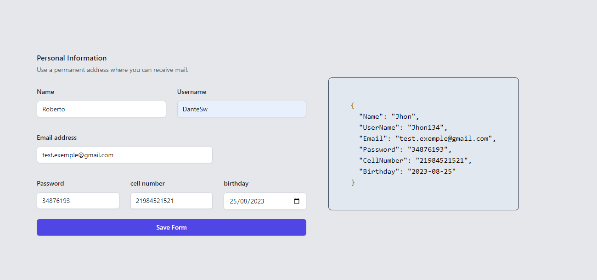
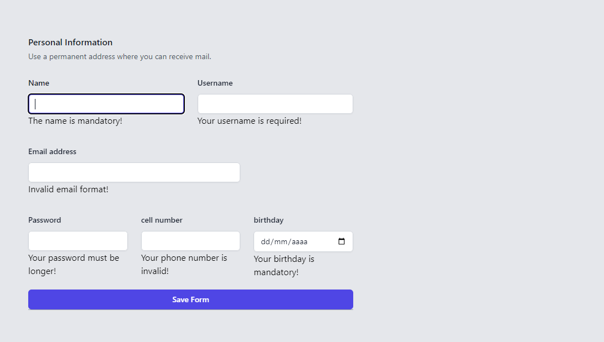

# Formulario Avançado

Esse projeto foi feito ao longos de alguns messes a fim de testar meus conhecimentos em next e no framework Zod. 

Esse formulario feito em zod apresenta validação de campos e ao final do submit ele retorna um JSON. Caso o usuario tente fazer o envio do form, o mesmo fara uma validação e apresentara erro em cada campo vazio 

 [🔗 Clique aqui para acessar](https://newjsonform.netlify.app/)

## Screenshots

